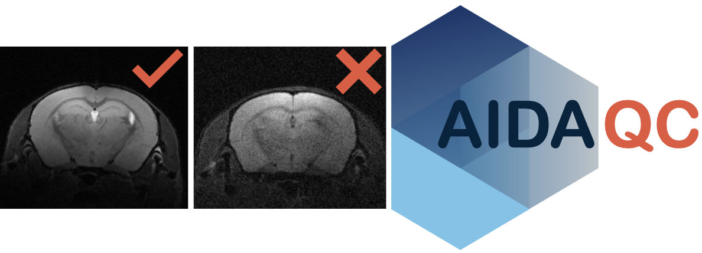

<h1>AIDA<i>qc</i> — MRI phantom analysis</h1>

This branch is specifically for **MRI phantom data only**. It preserves the phantom-specific analysis previously developed in `open-dev`, including sphere/ROI overlays, additional motion and ghosting metrics, and the PDF QA report. For animal MRI data, use the [main branch](https://github.com/Aswendt-Lab/AIDAqc/tree/main).

## Manual

Use the [updated phantom workflow manual](docs/AIDAqc_open_dev.pdf). The filename retains its former `open-dev` name; this is the manual bundled with the phantom implementation.

## Installation

Clone the phantom branch:

```bash
git clone --branch phantom https://github.com/Aswendt-Lab/AIDAqc.git
cd AIDAqc
```

Create and activate the Conda environment for your architecture:

```bash
# Apple Silicon (ARM64)
conda env create -n aidaqc -f aidaqc-arm64.yaml

# Intel: use this instead of the ARM64 environment
conda env create -n aidaqc -f aidaqc-intel.yaml

conda activate aidaqc
```

## Run phantom quality control

Inputs can be Bruker raw data or NIfTI files containing anatomical, diffusion, or functional/time-series phantom acquisitions. Follow the manual for data preparation and sequence naming.

```bash
# Bruker raw data
python scripts/ParsingData.py -i /path/to/phantom/data -o /path/to/qc/output -f raw

# NIfTI data
python scripts/ParsingData.py -i /path/to/phantom/data -o /path/to/qc/output -f nifti
```

Optional arguments:

- `-s SUFFIX`: select NIfTI files with a specific filename suffix.
- `-e NAME [NAME ...]`: exclude sequences by name.

Keep the output directory outside the input directory so subsequent runs do not parse generated files.

## Results

The pipeline produces feature CSV tables, QC images, sphere/ROI overlays, and a PDF QA report after outlier detection. Additional `MI_anat.csv`, `MI_diff.csv`, and `MI_func.csv` tables contain motion and numeric ghosting metrics for the available sequence types. Anatomical thin-slice data can use an ellipsoid ROI fallback.

Review the QC images alongside the quantitative results. The animal MRI validation and example datasets described on `main` do not establish validation of this phantom-specific workflow.

## Branches

- [**phantom**](https://github.com/Aswendt-Lab/AIDAqc/tree/phantom): MRI phantom data only; preserves the former `open-dev` implementation and its PDF QA report.
- [**main**](https://github.com/Aswendt-Lab/AIDAqc/tree/main): stable animal MRI workflow.
- [**open-dev**](https://github.com/Aswendt-Lab/AIDAqc/tree/open-dev): general development based on `main`. Porting the PDF export to this baseline is planned separately.

## Contact and contributions

Report problems through the [issue tracker](https://github.com/Aswendt-Lab/AIDAqc/issues) and specify that you are using `phantom`. See [CONTRIBUTING.md](CONTRIBUTING.md) for contribution guidance.

For other inquiries: Markus Aswendt (aswendtATmed.uni-frankfurt.de).

## License

[GNU General Public License v3.0](LICENSE)
